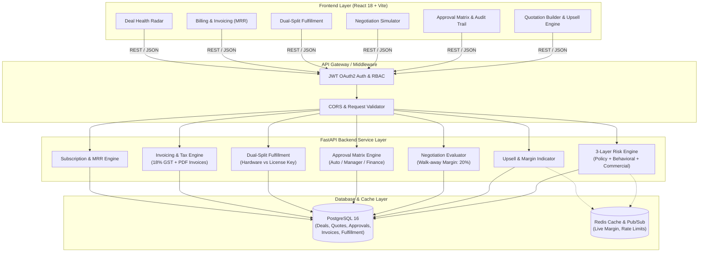
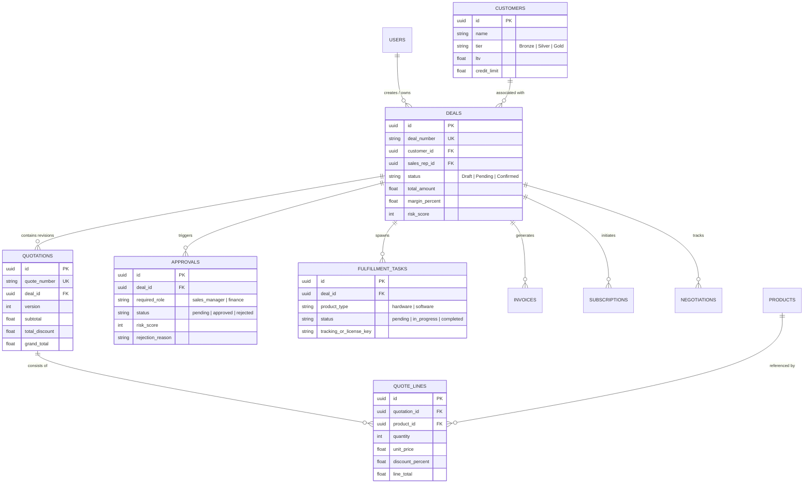

# DealFlow360 🚀
### Intelligent Quote-to-Cash Engine with 3-Layer Risk Assessment & Autonomous Governance

[](https://fastapi.tiangolo.com/)
[](https://reactjs.org/)
[](https://www.postgresql.org/)
[](https://redis.io/)
[](https://www.docker.com/)

---

## 📌 Executive Summary

**DealFlow360** eliminates revenue leakage, rogue discounting, and manual approval bottlenecks in enterprise quote-to-cash workflows. By blending **deterministic governance rules** (tier-based discount ceilings, category caps) with a **3-layer blended risk engine** (Policy + Behavioral + Commercial), DealFlow360 provides sales reps with real-time margin visibility and automated approval routing.

---

## 🏗️ System Architecture



---

## 🗄️ Database Schema & Entity Relationships



---

## 🧠 Core Risk & Governance Engine

### 1. Three-Layer Blended Risk Formula
$$\text{Total Risk Score} = \text{Policy Risk} (0-60) + \text{Behavioral Risk} (0-30) + \text{Commercial Risk} (0-30)$$

| Layer | Trigger Conditions | Scoring Metric |
|---|---|---|
| **Policy Risk** | Line item discount exceeds $\min(\text{Customer Tier}, \text{Product Category})$ ceiling | Base **$41 \text{ pts}$** $+ (3 \times \% \text{ over ceiling})$ |
| **Behavioral Risk** | Deal inactivity or excessive haggling | $>7\text{ days idle}$ ($+2 \text{ pts/day}$), $>3 \text{ rounds}$ ($+3 \text{ pts/round}$) |
| **Commercial Risk** | Gross profit margin falls below $25\%$ target | Margin $<25\%$ ($+2 \text{ pts per } 1\% \text{ drop}$) |

### 2. Autonomous Approval Matrix
- **$\le 40$ Risk Score**: **Auto-Approved** $\rightarrow$ Deal status directly set to `CONFIRMED`.
- **$41 - 70$ Risk Score**: Escalated to **Sales Manager** $\rightarrow$ `PENDING_APPROVAL`.
- **$> 70$ Risk Score**: Escalated to **Finance Head** $\rightarrow$ `PENDING_APPROVAL`.

### 3. Discount Governance Ceilings

| Entity | Category / Tier | Max Permitted Discount |
|---|---|:---:|
| **Customer Tier** | 🥇 Gold | **15%** |
| | 🥈 Silver | **10%** |
| | 🥉 Bronze | **5%** |
| **Product Category** | 💻 Software | **20%** |
| | 🖥️ Hardware | **15%** |
| | 🛠️ Services | **10%** |
| | 🔄 Subscriptions | **5%** |

*Rule: Strictest ceiling applies: $\text{Limit} = \min(\text{Tier Limit}, \text{Category Limit})$.*

---

## 🌟 Key Application Features

1. **Interactive Quotation Builder**:
   - Dynamic real-time calculation of order revenue, costs, and gross profit margin.
   - Live discount ceiling indicator per line item.
2. **Real-Time Upsell Suggestion Engine**:
   - Evaluates unselected products and shows the positive margin delta ($\Delta \text{Margin}$) if added.
3. **Interactive Negotiation Simulator**:
   - Tests customer counter-offers against a strict $20\%$ walk-away margin.
   - Recommends intelligent compromise trade-offs (e.g., higher volume / longer terms for requested discount).
4. **Automated Dual-Split Fulfillment**:
   - Confirmed deals automatically split hardware orders (warehouse shipping, serial tracking) from software products (instant license keys).
5. **Subscription & Tax Billing**:
   - Full invoice generation with 18% GST/VAT calculation and PDF preview.
   - Recurring SaaS contract management and MRR/ARR tracking.

---

## 🚀 Getting Started

### Prerequisites
- [Docker Desktop](https://www.docker.com/products/docker-desktop/) (recommended)
- Node.js 18+ & Python 3.11+ (for local bare-metal run)

### Running with Docker Compose (1-Click Startup)

```bash
docker compose up --build
```

- **Frontend App**: `http://localhost:5173`
- **Backend API & Swagger Docs**: `http://localhost:8000/docs`

---

## 🔑 Default Demo Credentials

| Role | Email | Password |
|---|---|---|
| **System Admin** | `admin@dealflow.com` | `admin123` |
| **Sales Manager** | `manager@dealflow.com` | `manager123` |
| **Sales Rep** | `rep@dealflow.com` | `rep123` |
| **Finance Controller** | `finance@dealflow.com` | `finance123` |

---

## 📡 API Endpoints Reference

| Module | Method | Endpoint | Description |
|---|---|---|---|
| **Auth** | `POST` | `/api/auth/login` | JWT OAuth2 Login |
| **Quotes** | `POST` | `/api/quotes/` | Create Quote with Risk & Route Assessment |
| **Quotes** | `POST` | `/api/quotes/upsell-suggestions` | Calculate Live Upsell Margin Impact |
| **Approvals** | `GET` | `/api/approvals/` | Fetch Pending Approval Queue |
| **Approvals** | `POST` | `/api/approvals/{id}/act` | Approve/Reject Quote with Reason |
| **Negotiations** | `POST` | `/api/negotiations/evaluate` | Smart Counter-Offer Evaluation |
| **Fulfillment** | `GET` | `/api/fulfillment/deal/{id}` | View Hardware / Digital Split Tasks |
| **Billing** | `GET` | `/api/billing/invoices` | List Invoices & Tax Calculations |
| **Subscriptions** | `GET` | `/api/subscriptions/` | List Active Recurring Contracts (MRR) |
| **Dashboard** | `GET` | `/api/dashboard/stats` | Top-line Dealflow Metrics |